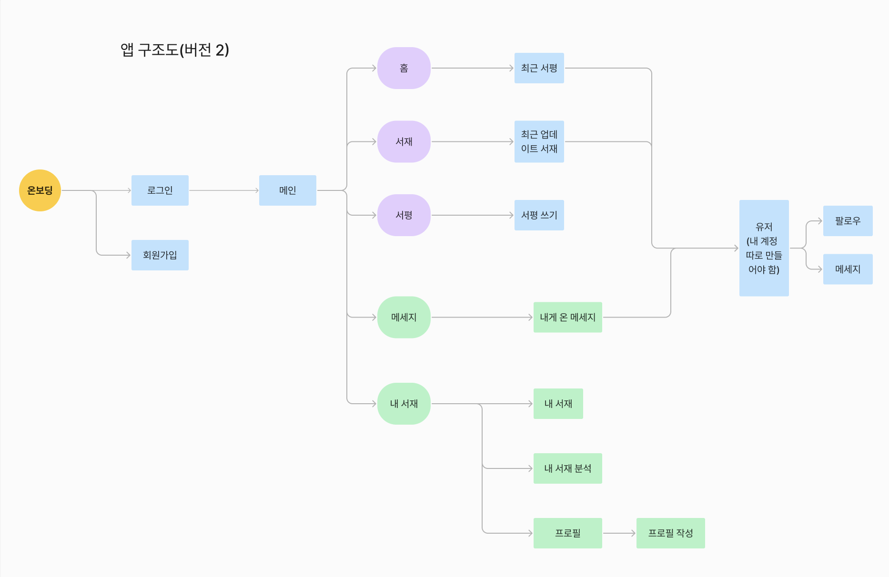
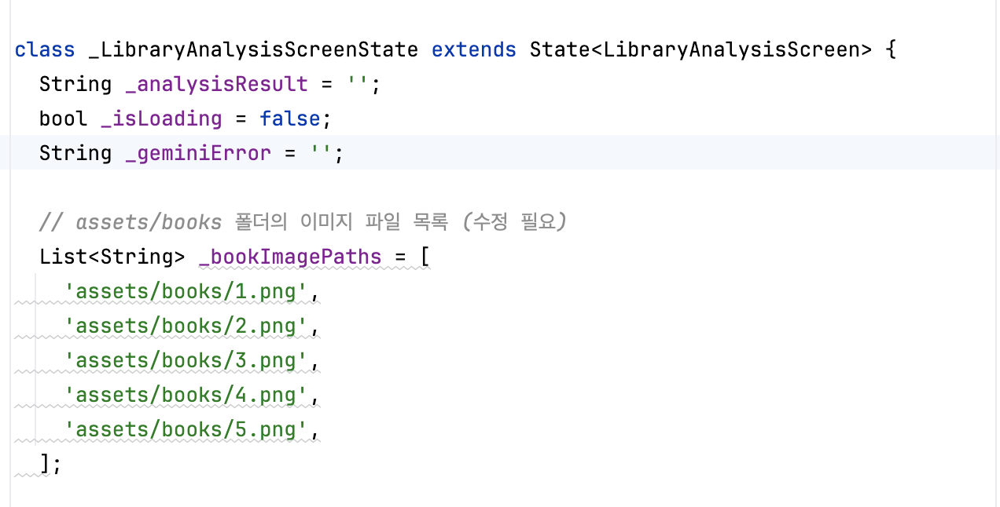
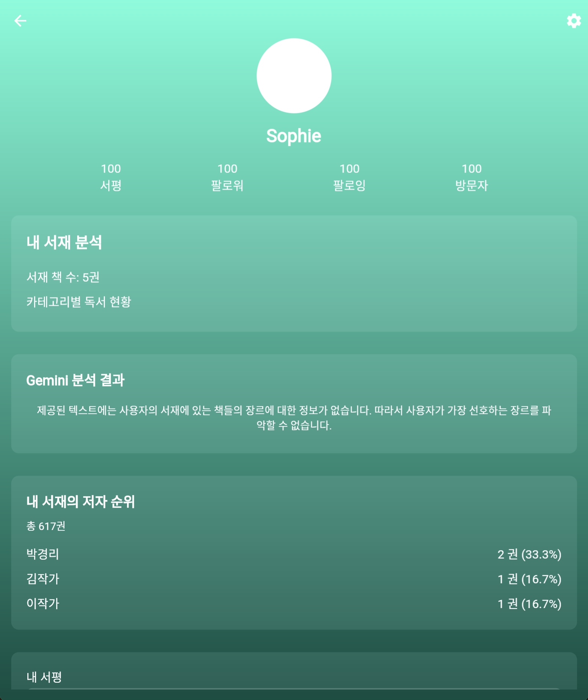
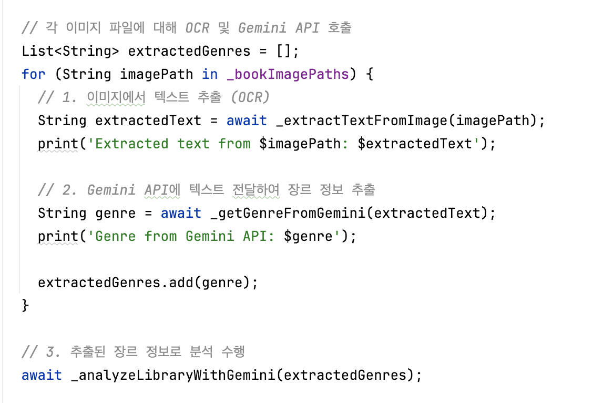

# AIFFEL Campus Online Code Peer Review Templete
- 코더 : 고명지
- 리뷰어 : 고명지 

1. 기본 기능 구현 및 UI 디자인
    - 쉬움: 앱이 오류 없이 실행되며 기본 기능이 작동한다.
    - 중간: 와이어프레임에 따라 UI가 적절히 구현되어 있다.
    - 어려움: UI/UX가 사용자 친화적이며 앱의 목적에 부합한다.
      
기본 기능이 작동합니다.

2. 데이터 모델 및 상태 관리
    - 쉬움: 앱의 목적에 맞는 기본적인 데이터 모델이 정의되어 있다.
    - 중간: 데이터가 UI에 올바르게 표시되고 업데이트된다.
    - 어려움: 효과적인 상태 관리 기법(예: 상태 관리 라이브러리 사용)이 적용되어 있다.

정보 구조도
 
기본적인 데이터 모델이 정의되어 있다고 생각합니다.
 

3. 네비게이션 및 사용자 상호작용
    - 쉬움: 최소 2개 이상의 화면(페이지) 간 이동이 가능하다.
    - 중간: 사용자 입력에 대한 적절한 응답과 피드백이 제공된다.
    - 어려움: 복잡한 네비게이션 구조나 고급 사용자 상호작용 기능이 구현되어 있다.

최소 2개 이상의 화면 간 이동이 위의 영상을 통해 이동이 가능하다는 것을 확인할 수 있습니다. 

4. 고급 기능 및 외부 서비스 연동
    - 쉬움: 기본적인 디바이스 기능(예: 카메라 접근)이 구현되어 있다.
    - 중간: 로컬 데이터 저장 및 검색 기능이 구현되어 있다.
    - 어려움: 외부 API 연동이나 실시간 데이터 동기화 기능이 구현되어 있다.

카메라 접근은 구현해보려고 하였으나 아직 구현하지 못했습니다.
외부 api는 연동은 하였으나 원하는 결과값이 도출되지는 못했습니다. 
 

5. 코드 품질 및 창의성
    - 쉬움: 코드가 기본적인 구조를 갖추고 있으며 주요 부분에 주석이 있다.
    - 중간: 코드가 잘 구조화되어 있고 가독성이 좋다.
    - 어려움: 재사용 가능한 컴포넌트, 효율적인 알고리즘 등 고급 코딩 기법이 적용되어 있다.
    - 모든 수준: 앱의 주제나 기능이 독창적이고 창의적이다.
  
코드가 기본적인 구조를 갖추고 있으며 주요 부분에 주석이 있습니다. 
 

# 회고(참고 링크 및 코드 개선)

카메라를 구현하는 부분이 생각보다 쉽지 않았습니다. 오랜 시간을 들였는데 결국 시간안에 해결하지 못한 점이 아쉽습니다.
그리고 api를 구현하는 과정이 생각했던 것보다는 쉬웠습니다.
api를 활용한 어플들이 많이 등장하는 이유를 알 수 있었습니다. 

api를 활용하여 데이터를 분석하는 과정에서도 이유는 알 수 없지만 잘 구현되지 않았습니다. 
이 번 퀘스트는 쉽지 잘 구현되지 않는 점들이 많았지만,
구현하기 위해 노력하는 과정에서 많이 배웠습니다.
쉽지 않지만 ^^; 그래도 오늘도 조금 더 알았음에 만족하며 힘을 내어보려고 합니다. ^^
