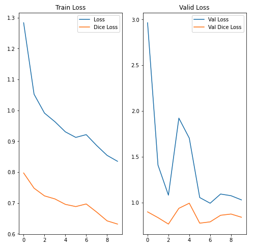

# AIFFEL Campus Online Code Peer Review Templete
- 코더 : 고명지


# Set hyperparameters(Case 모두 동일한 하이퍼 파라미터 적용)

image_size = 256

img_shape = (image_size, image_size, 3)

batch_size = 8

max_epochs = 10


Case 1: Encoder-Decoder model - mean_iou: 0.631983451996782

 

결과 분석)
1. 훈련 손실 (Train Loss) 분석:

Loss (파란색): 훈련 데이터에 대한 손실로, 전반적으로 감소하는 추세를 보입니다. 이는 모델이 훈련 데이터를 학습하고 있다는 것을 의미합니다. 하지만, 감소폭이 점차 줄어드는 것으로 보아 학습이 거의 완료되었거나, 학습률이 너무 낮아 더 이상 학습이 진행되지 않을 가능성이 있습니다.

Dice Loss (주황색): 훈련 데이터에 대한 Dice Loss도 감소하는 추세를 보입니다. Loss보다 낮은 값을 가지며, 감소폭은 크지 않습니다.

2. 검증 손실 (Valid Loss) 분석:

Val Loss (파란색): 검증 데이터에 대한 손실로, 초기에는 급격히 감소하지만, 이후에는 다시 증가하거나 변동이 심한 불안정한 모습을 보입니다. 특히, 2 epoch 이후부터는 loss가 증가와 감소를 반복하며 훈련이 안정적으로 진행되지 못하고 있습니다. 이는 과적합(Overfitting)이 발생했음을 강하게 시사합니다.

Val Dice Loss (주황색): 비교적 안정적인 값을 유지하지만, Val Loss와 마찬가지로 뚜렷한 감소 추세를 보이지 않습니다. Val Loss에 비해 낮은 값을 가지지만, 5 epoch 이후부터는 오히려 증가하는 경향을 보이기도 합니다.


Case 2: u-net model - mean_iou: 0.9403515949039798

 

결과 분석)
1. 훈련 손실 (Train Loss) 그래프:Loss와 Dice Loss의 간격: 두 Loss 값 사이의 간격이 좁혀지는 것을 확인할 수 있습니다. 이는 모델이 Cross-entropy Loss와 Dice Loss를 모두 만족시키는 방향으로 학습되고 있음을 의미합니다.

2. 검증 손실 (Valid Loss) 분석:
Val Loss (파란색): 검증 데이터에 대한 손실로, 훈련 초기에 급격하게 감소하지만, 이후에는 거의 변화가 없는 것을 확인할 수 있습니다. 특히, 0-2 epoch 사이에 급격하게 감소한 이후에는 거의 수렴하는 형태를 보입니다. 이는 모델이 검증 데이터에 대해 더 이상 학습 효과를 보기 어렵다는 것을 시사합니다.
Val Dice Loss (주황색): Val Loss와 마찬가지로 낮은 값을 유지하며, 거의 변화가 없습니다. Val Loss와 Val Dice Loss의 간격이 매우 좁은 것을 확인할 수 있습니다.

3. 전체적인 해석:

과적합(Overfitting) 가능성: 훈련 손실은 꾸준히 감소하는 반면, 검증 손실은 특정 시점 이후로는 개선되지 않는 것은 모델이 훈련 데이터에 과적합되었을 가능성을 시사합니다. 즉, 훈련 데이터에만 지나치게 맞춰져서 새로운 데이터에 대한 일반화 성능이 떨어질 수 있습니다.

3.1. 성능 개선 필요: Val Dice Loss가 개선되지 않는다는 것은 모델의 일반화 성능이 낮다는 것을 의미합니다. 즉, 새로운 데이터에 대한 예측 능력이 떨어진다는 것입니다.


👉Cross-entropy Loss (교차 엔트로피 손실): 주로 분류(classification) 문제에서 사용되는 Loss 함수입니다. 예측 확률 분포와 실제 확률 분포 간의 차이를 측정합니다.


Case 3: unet+vgg16 - mean_iou: 0.5760845868524777

 

결과 분석)
1. 훈련 손실 (Train Loss) 분석:

Loss (파란색): 훈련 데이터에 대한 손실로, 에폭이 진행될수록 꾸준히 감소하는 일반적인 경향을 보입니다. 이는 모델이 훈련 데이터를 학습하면서 예측 오류를 줄여나가고 있다는 것을 의미합니다.

Dice Loss (주황색): 훈련 데이터에 대한 Dice Loss 또한 감소하는 추세를 보입니다. Loss(Cross-entropy) 보다 낮은 값을 가지며, 감소폭도 Loss보다 크게 나타납니다. 이는 모델이 픽셀 단위 분류 뿐 아니라 영역 분할 능력도 향상시키고 있음을 시사합니다.

2. 검증 손실 (Valid Loss) 분석:

Val Loss (파란색): 검증 데이터에 대한 손실로, 초기에는 크게 감소하지만, 2-3 epoch 이후로는 변동이 크고 오히려 증가하는 구간도 나타납니다. 이는 일반적인 과적합(Overfitting)의 징후를 보입니다.

Val Dice Loss (주황색): Val Loss와 유사하게, 초기에는 감소하지만 이후에는 변동폭이 크고 안정적인 수렴을 보이지 못합니다. Val Loss와 비슷한 시점에서 증가하는 경향을 보이는 것으로 보아, 전반적으로 모델이 검증 데이터셋에 대해 일반화 능력을 확보하지 못하고 있음을 시사합니다.

3. 전체적인 해석:

과적합 문제: 훈련 데이터에 대한 손실은 감소하지만, 검증 데이터에 대한 손실은 불안정하게 변동하는 것은 모델이 훈련 데이터에 과적합되었음을 나타냅니다. 이는 훈련 데이터에만 지나치게 맞춰져 새로운 데이터에 대한 예측 성능이 떨어진다는 의미입니다.


Case 4: unet+vgg16+stepdecay - mean_iou: 0.4841173547366614

 

결과 분석)
1. 훈련 손실 (Train Loss) 분석:

Loss (파란색): 훈련 데이터에 대한 손실로, 에폭이 진행됨에 따라 꾸준히 감소하는 경향을 보입니다. 이는 모델이 훈련 데이터에 대해 학습을 진행하고 있음을 나타냅니다.

Dice Loss (주황색): Loss와 마찬가지로 에폭이 진행됨에 따라 감소하는 경향을 보입니다. Dice Loss는 이미지 분할 성능을 나타내는 지표이므로, 모델이 훈련 데이터의 객체를 분할하는 능력이 향상되고 있음을 알 수 있습니다.

2. 검증 손실 (Valid Loss) 분석:

Val Loss (파란색): 검증 데이터에 대한 손실로, 초기 몇 에폭 동안 급격하게 감소하지만, 이후에는 거의 수렴하는 형태를 보입니다. 이는 모델이 초기에는 검증 데이터에 대해 빠르게 학습하지만, 이후에는 더 이상 학습 효과를 보기 어렵다는 것을 의미합니다. 변동폭이 크지 않은 것으로 보아 과적합은 심각하지 않은 것으로 보입니다.

Val Dice Loss (주황색): Val Loss와 유사하게 낮은 값을 유지하며, 거의 변화가 없습니다. 훈련 과정이 안정화 되었음을 시사합니다.

3. 전체적인 해석:

Step Decay 효과: Step Decay Learning Rate Scheduling을 통해 검증 손실을 낮추고, 모델의 일반화 성능을 향상시키는 데 어느 정도 성공한 것으로 보입니다. 이전 결과에 비해 검증 손실이 안정적으로 유지되고, 변동성이 줄어든 것을 확인할 수 있습니다.


# 회고(참고 링크 및 코드 개선)
Cross-entropy loss: 픽셀 단위의 정확도
Dice loss: 영역 단위의 정확도
mIoU (mean Intersection over Union) metric

(설명)
Cross-entropy loss와 Dice loss를 함께 사용하여 mean Intersection over Union (mIoU) 를 높이도록 학습하는 것은 이미지 분할 (Image Segmentation) 작업에서 흔히 사용되는 전략입니다. Loss 함수를 사용하는 이유와 두 Loss 함수를 함께 사용하는 이유를 자세히 설명해 드리겠습니다.

1. Loss 함수의 역할:

모델 학습의 지표: Loss 함수는 모델의 예측 결과와 실제 정답(ground truth) 간의 차이를 수치화하는 함수입니다. 모델이 얼마나 "잘못" 예측했는지를 나타내는 지표라고 할 수 있습니다.

모델 최적화의 방향 제시: 딥러닝 모델은 Loss 함수 값을 최소화하는 방향으로 학습됩니다. 즉, Loss 함수는 모델이 학습해야 할 방향을 제시하는 역할을 합니다.

가중치 업데이트: Loss 함수 값은 모델 내부의 가중치(weights)를 업데이트하는 데 사용됩니다. 경사 하강법(gradient descent)과 같은 최적화 알고리즘은 Loss 함수의 기울기를 계산하여 가중치를 조정하고, Loss 함수 값을 점진적으로 감소시킵니다.

2. Cross-entropy Loss:

정의: 주로 분류(classification) 문제에서 사용되는 Loss 함수입니다. 예측 확률 분포와 실제 확률 분포 간의 차이를 측정합니다.

특징:

각 클래스에 대한 예측 확률을 독립적으로 평가합니다.

예측이 틀린 경우, 즉 실제 클래스에 대한 예측 확률이 낮을수록 Loss 값을 크게 부여합니다.

장점:

구현이 비교적 간단합니다.

다양한 분류 문제에 적용 가능합니다.

단점:

클래스 불균형 문제에 취약할 수 있습니다. 즉, 특정 클래스의 데이터가 다른 클래스에 비해 매우 적은 경우, 해당 클래스에 대한 학습이 제대로 이루어지지 않을 수 있습니다.

이미지 분할 문제에서 영역(region) 기반의 특징을 잘 반영하지 못할 수 있습니다. 즉, 픽셀 단위의 정확도는 높일 수 있지만, 전체적인 영역의 형태나 연결성을 고려하지 못할 수 있습니다.

3. Dice Loss:

정의: 이미지 분할 문제에서 주로 사용되는 Loss 함수입니다. 예측 영역과 실제 영역 간의 Overlap (겹치는 정도) 을 측정합니다.

특징:

두 영역 간의 유사도를 측정하는 Dice coefficient를 기반으로 합니다.

클래스 불균형 문제에 덜 민감합니다. 즉, 특정 클래스의 영역이 다른 클래스에 비해 매우 작은 경우에도 비교적 안정적인 학습이 가능합니다.

전체적인 영역의 형태나 연결성을 고려합니다.

장점:

클래스 불균형 문제에 강합니다.

이미지 분할 성능 향상에 효과적입니다.

단점:

구현이 Cross-entropy Loss보다 복잡할 수 있습니다.

매우 작은 객체에 대해서는 불안정할 수 있습니다.

4. Cross-entropy Loss와 Dice Loss를 함께 사용하는 이유:

상호 보완: Cross-entropy Loss와 Dice Loss는 서로 다른 장단점을 가지고 있습니다. 따라서 두 Loss 함수를 함께 사용하면 서로의 단점을 보완하고, 장점을 극대화할 수 있습니다.

클래스 불균형 문제 완화: Dice Loss는 클래스 불균형 문제에 강하므로, Cross-entropy Loss의 단점을 보완할 수 있습니다.

영역 기반 특징 강화: Dice Loss는 영역 기반의 특징을 잘 반영하므로, 이미지 분할 결과의 전체적인 품질을 향상시킬 수 있습니다.

mIoU 향상: mIoU (mean Intersection over Union) 는 이미지 분할 모델의 성능을 평가하는 지표 중 하나입니다. Cross-entropy Loss와 Dice Loss를 함께 사용하면 mIoU 값을 높이는 데 효과적입니다.

# 회고(참고 링크 및 코드 개선)
```
# 리뷰어의 회고를 작성합니다.
# 코드 리뷰 시 참고한 링크가 있다면 링크와 간략한 설명을 첨부합니다.
# 코드 리뷰를 통해 개선한 코드가 있다면 코드와 간략한 설명을 첨부합니다.
