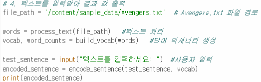

# AIFFEL Campus Online Code Peer Review Templete
- 코더 : 고명지
- 리뷰어 : 송명근


# PRT(Peer Review Template)
- [X]  **1. 주어진 문제를 해결하는 완성된 코드가 제출되었나요?**
    - 함수를 선언한 뒤 마지막에 함수를 호출하는 구조이다.
    - 마지막에 유저에게 입력을 받아서 함수를 이용해 결과값이 출된다.
    - 
    
- [X]  **2. 전체 코드에서 가장 핵심적이거나 가장 복잡하고 이해하기 어려운 부분에 작성된 
주석 또는 doc string을 보고 해당 코드가 잘 이해되었나요?**
    - 정규표현식을 이용하여 특수문자를 제거하는 코드가 잘 작성되었고 정규표현식에 대한 설명이 충분하다.
    - 파이썬의 collection을 이용하여 빈도수를 잘 count했고 기능에 대해서 설명이 잘 적혀있다.
    - enumerate를 이용하여 각 단어별 순위를 잘 부여했고 주석을 통해 변수별로 설명이 상세히 적혀있다.
    - [주석작성](./doc.png)
        
- [X]  **3. 에러가 난 부분을 디버깅하여 문제를 해결한 기록을 남겼거나
새로운 시도 또는 추가 실험을 수행해봤나요?**
    - 디버깅이나 문제해결 기록은 별도로 존재하지 않지만 코드에 대한 구동방식은 잘 작성되어있다.
        
- [X]  **4. 회고를 잘 작성했나요?**
    - 코드를 작성할때 GPT의 도움을 받은점, 이후 GPT의 코드를 이해하려고 하였다.
        
- [X]  **5. 코드가 간결하고 효율적인가요?**
    - text를 분석할때 필요한 기능들을 별도의 함수들을 선언하였다.
    - 마지막에 선언한 함수를 이용하여 text파일과 입력단어를 이용하여 순위를 출력하여 


# 회고(참고 링크 및 코드 개선)
```
다양한 방법을 시도해본 흔적이 보입니다.
처음 보는 기능들을 사용해서 어려웠겠지만 계속 공부를 하며 이해하는 것이 잘 보였습니다!
고생 많으셨습니다.
```
