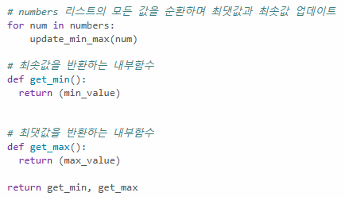
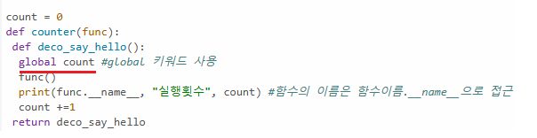

# AIFFEL Campus Online Code Peer Review Templete
- 코더 : 코더의 이름을 작성하세요.
- 리뷰어 : 리뷰어의 이름을 작성하세요.


# PRT(Peer Review Template)
- [x]  **1. 주어진 문제를 해결하는 완성된 코드가 제출되었나요?**
    Yes
    
    
- [ ]  **2. 전체 코드에서 가장 핵심적이거나 가장 복잡하고 이해하기 어려운 부분에 작성된 
주석 또는 doc string을 보고 해당 코드가 잘 이해되었나요?**
    1. 최솟값을 반환하는것과 최댓값을 반환 할때 return 을 사용하는게 핵심이라 생각
    
    2. global함수를 써서 밖에있는 count를 전역 변수로 가져와 계속 사용할수 있도록 한점
    
    - docstring은 없지만 주석은 잘 사용
   
        
- [ ]  **3. 에러가 난 부분을 디버깅하여 문제를 해결한 기록을 남겼거나
새로운 시도 또는 추가 실험을 수행해봤나요?**
    문제해결 방법이랑 실수한점은 설명으로 들음
        
- [ ]  **4. 회고를 잘 작성했나요?**
    회고에 function에 대한 약어에 따른 오류 그리고 해결방법을 작성
    
    
        
- [ ]  **5. 코드가 간결하고 효율적인가요?**
    네 간결합니다.


# 회고(참고 링크 및 코드 개선)
```
# 내가 할때 함수를 넣지 않고는 오류가 떴는데 여기서 함수를 넣지않고도 오류가 뜨지 않아서 
 물어보면서 문제를 해결함
# 수고하셨습니다~!